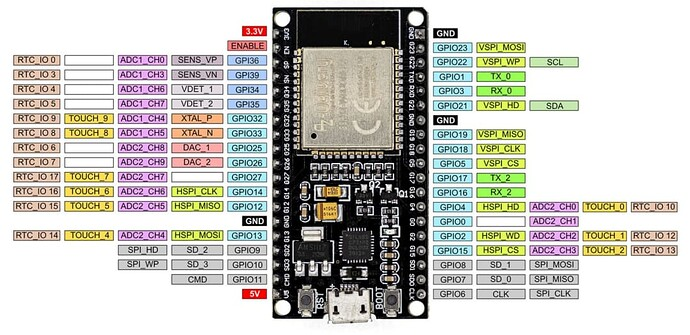

# K4TFJ-Projects  (https://www.youtube.com/@k4tfjprojects296)
Mostly links to websites i want to access in the future, but also might save some for historical purposes.

ESP32-Cheap-Yellow-Display: 
https://github.com/witnessmenow/ESP32-Cheap-Yellow-Display

I2C Address List: 
https://i2cdevices.org/addresses

